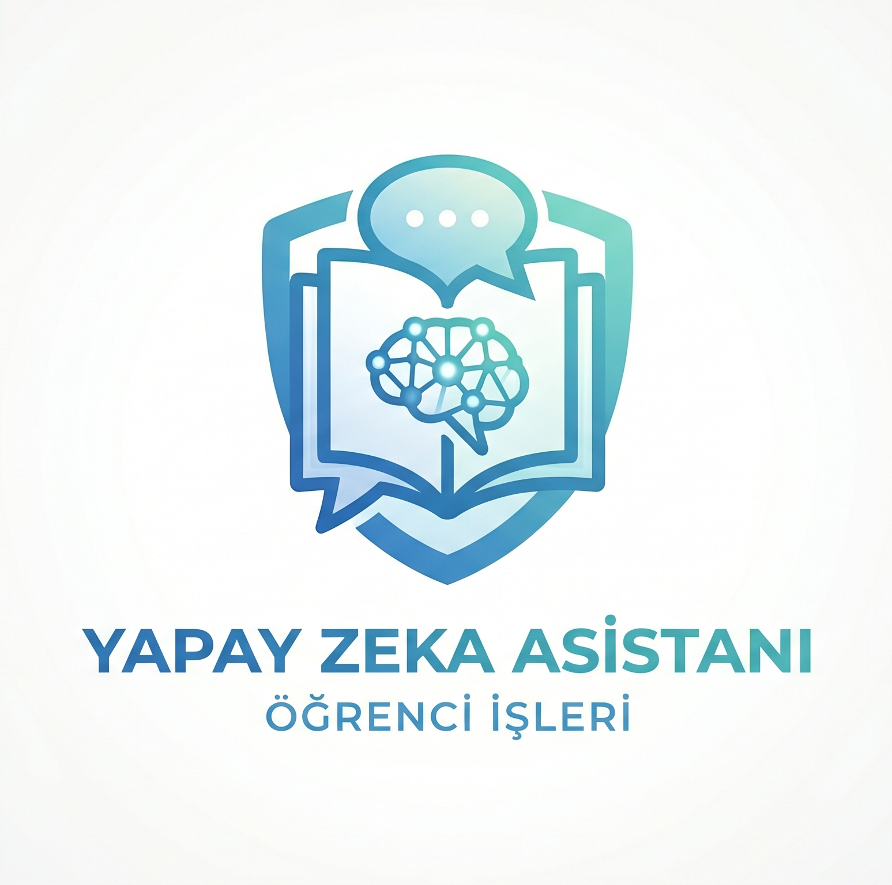

<div align="center">



# 🎓 PAU Öğrenci İşleri Asistanı

**Pamukkale Üniversitesi için RAG Tabanlı Yerel Yapay Zeka Asistanı**

</div>

---

## 🔭 Vizyon

Öğrenciler ve akademik personel, üniversiteye ilişkin yönetmelik, süreç ve prosedür sorularını yanıtlamak için onlarca sayfalık PDF dokümanını taramak, birimleri aramak ya da uzun e-posta yazışmalarını beklemek zorunda kalmamalıdır.

**PAU Öğrenci İşleri Asistanı**, bu problemi kökten çözmek için tasarlanmıştır. Üniversitenin resmi yönergeleri ve sık sorulan sorular üzerine eğitilmiş, tamamen **yerel çalışan** (internet bağlantısı gerektirmeyen), **Türkçe** ve **güncel** bir yapay zeka asistanıdır. Sistem; iki kademeli hibrit RAG mimarisi sayesinde hızlı ve doğru yanıtlar üretirken, modeli harici bir sunucuya veri göndermeksizin kurumun kendi altyapısında çalıştırır.

---

## ✨ Özellikler

| Özellik                          | Açıklama                                                                                                                                    |
| -------------------------------- | ------------------------------------------------------------------------------------------------------------------------------------------- |
| 🔀 **Hibrit RAG (İki Kademeli)** | SSS-RAG → Yönerge-RAG zincirleme stratejisi; benzerlik skoru ≥ 0.88 ise model atlanarak SSS'ten direkt yanıt, aksi hâlde tam RAG pipeline'ı |
| 🧠 **Yerel LLM**                 | Qwen 2.5 7B — Q4_K_M nicemleme; internet bağlantısı gerektirmez, veri gizliliği tam                                                         |
| 📄 **PDF Bağlamı**               | Üniversite yönetmelikleri ve yönergelerinden otomatik vektör indeks oluşturma                                                               |
| 💬 **SSS Tabanı**                | Önceden doğrulanmış soru-cevap çiftleri; tekrarlayan sorularda anlık yanıt                                                                  |
| 🔁 **Konuşma Geçmişi**           | Oturum başına kalıcı JSON konuşma kaydı                                                                                                     |
| ⚡ **Yeniden Sıralama**          | `SentenceTransformerRerank` ile bağlam hassasiyeti artırılmış retrieval                                                                     |
| 🌐 **Modern Arayüz**             | React tabanlı, sohbet penceresine sahip duyarlı (responsive) web arayüzü                                                                    |
| 🔒 **Tam Çevrimdışı**            | `HF_HUB_OFFLINE=1` — Çalışma zamanında hiçbir harici API çağrısı yapılmaz                                                                   |

---

## 🏗️ Mimari

```
Kullanıcı Sorusu
      │
      ▼
┌─────────────────────────────────┐
│          SSS-RAG Katmanı        │  ← pau_sss_rag_db/
│   (multilingual-e5-large emb.)  │
└────────────┬────────────────────┘
             │
     Benzerlik Skoru?
      ┌──────┴──────────────┐
   >= 0.88                < 0.88
      │                      │
  Direkt SSS            Yönerge-RAG
   Yanıtı                Katmanı    ← pau_rag_db_v2/
  (model yok)               │
                      Reranker (STR)
                             │
                      Qwen 2.5 7B GGUF
                             │
                         Son Yanıt
```

---

## 🛠️ Teknik Yığın

| Katman            | Teknoloji                                      |
| ----------------- | ---------------------------------------------- |
| **LLM**           | Qwen 2.5 7B — Q4_K_M GGUF (`llama-cpp-python`) |
| **Embedding**     | `intfloat/multilingual-e5-large`               |
| **Reranker**      | `cross-encoder/ms-marco-MiniLM-L-6-v2`         |
| **RAG Çerçevesi** | LlamaIndex                                     |
| **Backend**       | FastAPI + Uvicorn                              |
| **Frontend**      | React 18 + Vite                                |
| **Veri Formatı**  | JSON (SSS, veri seti), PDF (yönergeler)        |
| **Platform**      | Windows / Linux (CPU veya GPU)                 |

---

## 📦 Kurulum ve Çalıştırma

### 1 — Ön Gereksinimler

Sisteminizde aşağıdakilerin kurulu olduğundan emin olun:

- **Python 3.10+** — `python --version`
- **Node.js 18+** — `node --version`
- **Git** — `git --version`
- En az **8 GB RAM** (model yükleme için); 16 GB önerilir
- İsteğe bağlı: NVIDIA GPU (CUDA desteği ile llama-cpp-python kurulursa hız 5-10x artar)

---

### 2 — Depoyu Klonlayın

```bash
git clone https://github.com/KULLANICI_ADINIZ/pau-ogrenci-isleri-asistani.git
cd pau-ogrenci-isleri-asistani
```

---

### 3 — Model Dosyasını İndirin ⚠️

Bu projede kullanılan model, PAU veri seti üzerinde **ince ayar (fine-tune) yapılmış** özel bir Qwen 2.5 7B Q4_K_M ağırlığıdır; standart Qwen modeli ile aynı değildir. Dosya boyutu (~4.5 GB) nedeniyle repoya dahil edilmemiş olup Google Drive üzerinden paylaşılmaktadır:

```
📥 İndirme Adresi (Google Drive):
https://drive.google.com/file/d/1C2psKQjIJ-YusWZFv5B7S0D452x0B3xY/view?usp=sharing
```

İndirilen dosyayı **`qwen7b-pau-Q4_K_M.gguf`** adıyla proje kök dizinine kopyalayın.

Dosya yerleşimi:

```
pau-ogrenci-isleri-asistani/
├── qwen7b-pau-Q4_K_M.gguf   ← buraya
├── backend/
├── frontend/
└── ...
```

---

### 4 — Python Bağımlılıklarını Yükleyin

```bash
pip install -r backend/requirements_web.txt
```

Ek olarak RAG ve model çalıştırma bağımlılıkları için:

```bash
pip install llama-cpp-python llama-index llama-index-embeddings-huggingface \
            llama-index-postprocessor-flag-embedding-reranker \
            sentence-transformers pymupdf
```

> **GPU hızlandırması için** (`llama-cpp-python` CUDA ile):
>
> ```bash
> CMAKE_ARGS="-DLLAMA_CUDA=on" pip install llama-cpp-python --force-reinstall --no-cache-dir
> ```

---

### 5 — PDF Dosyalarını Ekleyin

Üniversitenin resmi yönetmelik ve yönergelerini PDF formatında proje kök dizininde `pdf_dosyalari/` klasörü oluşturarak içine kopyalayın:

```
pdf_dosyalari/
├── lisansustu_yonerge.pdf
├── onlisans_lisans_yonerge.pdf
└── ...
```

---

### 6 — Vektör Veritabanlarını Oluşturun ⚠️

Vektör veritabanı klasörleri (`pau_rag_db_v2/` ve `pau_sss_rag_db/`) repoya dahil edilmemiştir; **ilk kurulumda sizin tarafınızdan oluşturulması** gerekmektedir.

**6a — Yönerge RAG Veritabanı** (PDF belgelerinden):

```bash
python database_create.py
```

> Bu komut `pdf_dosyalari/` içindeki tüm PDF'leri okur, parçalara böler, vektöre dönüştürür ve `pau_rag_db_v2/` klasörüne kaydeder. İşlem donanıma göre **5–20 dakika** sürebilir.

**6b — SSS RAG Veritabanı** (JSON soru-cevap tabanından):

```bash
python sss_rag_creator.py
```

> `pau_sss.json` dosyasını kaynak alarak `pau_sss_rag_db/` klasörünü oluşturur. Genellikle 1–2 dakika içinde tamamlanır.

---

### 7 — Backend'i Başlatın

```bash
cd backend
uvicorn main:app --host 0.0.0.0 --port 8000 --reload
```

API, `http://localhost:8000` adresinde çalışmaya başlar. İnteraktif API belgelerine `http://localhost:8000/docs` üzerinden erişebilirsiniz.

> **Not:** İlk istek geldiğinde model belleğe yüklenir (~30–60 sn). Sonraki istekler anında yanıtlanır.

---

### 8 — Frontend'i Başlatın

Yeni bir terminal penceresi açın:

```bash
cd frontend
npm install
npm run dev
```

Uygulama `http://localhost:5173` adresinde açılır.

---

## 📁 Dosya ve Klasör Yapısı

```
pau-ogrenci-isleri-asistani/
│
├── 📂 backend/                      # FastAPI sunucu uygulaması
│   ├── main.py                      # API endpoint'leri ve uygulama giriş noktası
│   ├── conversations.json           # Kalıcı konuşma geçmişi
│   └── requirements_web.txt         # Backend Python bağımlılıkları
│
├── 📂 frontend/                     # React web arayüzü
│   └── src/
│       ├── App.jsx                  # Uygulama kök bileşeni
│       ├── main.jsx                 # React uygulama giriş noktası
│       ├── index.css                # Global stiller
│       └── components/
│           ├── ChatWindow.jsx       # Sohbet mesaj akışı ve girdi alanı
│           ├── HomePage.jsx         # Karşılama ekranı ve hızlı sorular
│           └── Sidebar.jsx          # Konuşma geçmişi paneli
│
├── 📄 hibrit_asistan.py             # Çekirdek RAG motoru — iki kademeli hibrit strateji
├── 📄 database_create.py            # PDF → Yönerge vektör veritabanı oluşturucu
├── 📄 sss_rag_creator.py            # SSS JSON → SSS vektör veritabanı oluşturucu
├── 📄 sss-to-json.py                # Ham SSS verisi → yapılandırılmış JSON dönüştürücü
├── 📄 sss-üretici.py                # SSS veri seti üretim ve genişletme aracı
│
├── 📄 pau_dataset_temiz.json        # Temizlenmiş PAU veri seti (eğitim/değerlendirme)
├── 📄 pau_sss.json                  # Yapılandırılmış SSS soru-cevap tabanı
├── 🖼️  logo.png                     # Uygulama logosu
│
│   ── Repoya Dahil Edilmeyenler (.gitignore) ──────────────────
│
├── 🚫 qwen7b-pau-Q4_K_M.gguf       # Model dosyası
├── 🚫 pau_rag_db_v2/                # Yönerge vektör DB — database_create.py ile oluşturulmalı
├── 🚫 pau_sss_rag_db/               # SSS vektör DB — sss_rag_creator.py ile oluşturulmalı
├── 🚫 pdf_dosyalari/                # Üniversite yönerge PDF'leri — manuel eklenmeli
└── 🚫 __pycache__/                  # Python önbelleği
```

---

## 🔌 API Referansı

| Yöntem   | Endpoint              | Açıklama                               |
| -------- | --------------------- | -------------------------------------- |
| `POST`   | `/chat`               | Yeni mesaj gönder, asistan yanıtını al |
| `GET`    | `/conversations`      | Tüm konuşma geçmişini listele          |
| `GET`    | `/conversations/{id}` | Belirli bir konuşmayı getir            |
| `DELETE` | `/conversations/{id}` | Konuşmayı sil                          |
| `GET`    | `/status`             | Model yükleme durumunu sorgula         |
| `GET`    | `/docs`               | Otomatik Swagger API dokümantasyonu    |

---

## ❓ Sıkça Sorulan Kurulum Soruları

**`llama_cpp` import hatası alıyorum.**
Önce `pip install llama-cpp-python` komutunun başarıyla tamamlandığından emin olun. Windows'ta Visual C++ Build Tools kurulu olmalıdır.

**Model yüklenmiyor, hata veriyor.**
`qwen7b-pau-Q4_K_M.gguf` dosyasının proje kök dizininde olduğunu ve `hibrit_asistan.py` içindeki `MODEL_PATH` değişkeniyle eşleştiğini doğrulayın.

**Vektör DB klasörü bulunamadı hatası.**
`database_create.py` ve `sss_rag_creator.py` scriptlerini sırasıyla çalıştırarak veritabanlarını oluşturun (bkz. Adım 6).

**Frontend backend'e bağlanamıyor.**
Backend'in `8000` portunda, frontend'in `5173` portunda çalıştığını kontrol edin. `backend/main.py` içindeki CORS ayarları bu portları varsayılan olarak kabul eder.

---

<div align="center">

</div>
